    # 🧠 Sanjeevni AI, AI-Powered Health Prediction & Consultation Platform

    An all-in-one AI-powered web platform that helps patients **predict diseases**, **receive tailored medical advice**, **book medicines**, and **consult doctors**—all from the comfort of their home.

    ---

    ## 🩺 Problem Statement

    Patients often need to jump across multiple platforms for:
    - Identifying their health issues
    - Consulting a doctor
    - Buying prescribed medicines

    This process is time-consuming, inconvenient, and overwhelming, especially for people with urgent or chronic health issues.

    ---

    ## 💡 Proposed Solution

    We developed a centralized AI-powered healthcare platform that streamlines the entire journey:

    > Predict ➝ Advise ➝ Consult ➝ Cure ➝ Deliver

    - Symptom-based and MRI-based disease prediction using Machine Learning and Deep Learning
    - Detailed medical advice (precautions, medication, diet)
    - Direct consultation with certified doctors via video calls
    - Auto-booking and delivery of prescribed medicines

    ---
    
    ## 🛠️ Tech Stack

    | Component           |              Technology             |
    |---------------------|-------------------------------------|
    | Backend             | Python Django                       |
    | ML/DL Models        | Scikit-learn, TensorFlow, OpenCV    |
    | Text-to-Speech      | gTTS (Google Text-to-Speech)        |
    | Chat & Video Calls  | Jitsi                               |
    | Frontend            | HTML, CSS, JS, BootStrap, Tailwind  |
    | Payments            | PayStack Payment Gateway            |
    | Email Authentication| SMTP                                |
    | Database            | SQL               |
    |---------------------|-------------------------------------|
     --------

    ## 🔁 Workflow

    ### For Patients:
    1. **Disease Prediction**
    - Upload MRI (Brain Tumor / Alzheimer's)
    - Or select symptoms (Diabetes, Kidney, Heart, etc.)
    2. **Get Results**
    - Disease Name, Description, Precautions, Medication, Diet
    3. **Next Steps**
    - Book medicines (auto-filled & bill generated)
    - Or consult a doctor via video call
    4. **After Consultation**
    - Receive prescription via email
    - Book medicines
    - Get door-step delivery

    ### For Doctors:
    - Login/Register ➝ Manual verification ➝ Access dashboard
    - View schedules and upcoming consultations
    - Attend meetings via video call
    - Generate & send prescriptions
    - Get payment directly to account

    ---

    ## 📸 Screenshots

    ## 🖼️ Project Interface

    ### 🔹 Landing Page
    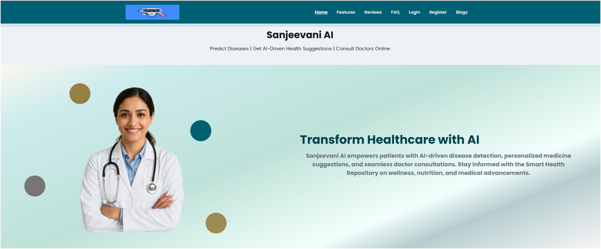

    ### 🔹 Key Features
    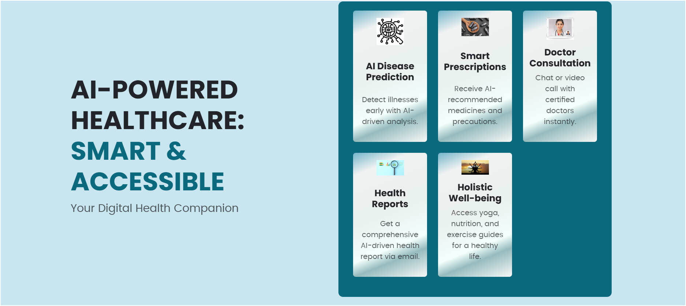

    ### 🔹 FAQ Section
    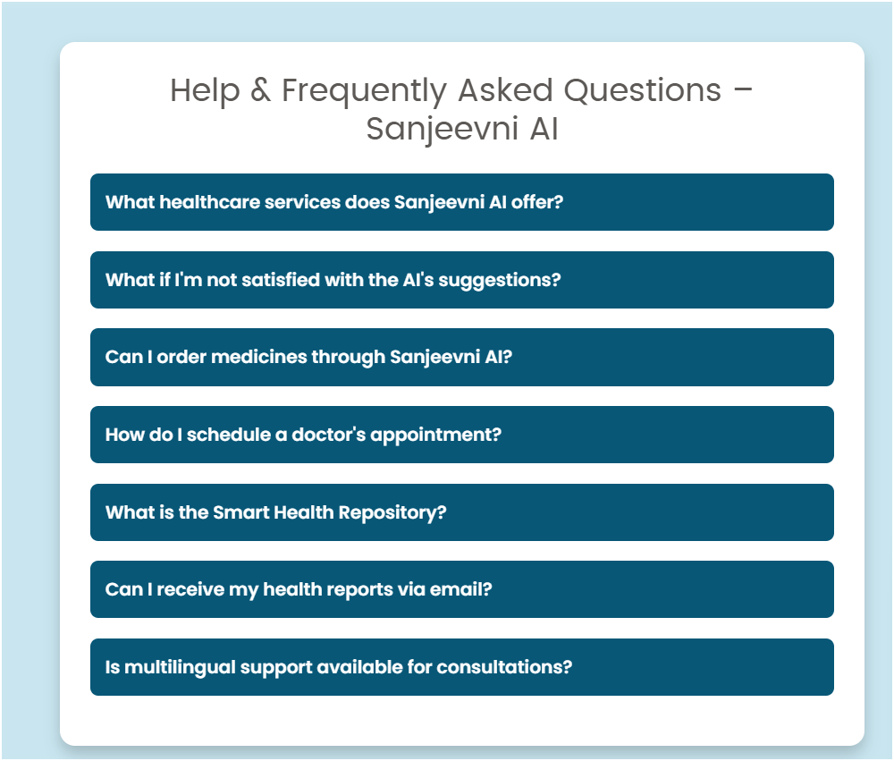

    ### 🔹 Admin Interface
    - Admin Dashboard  
    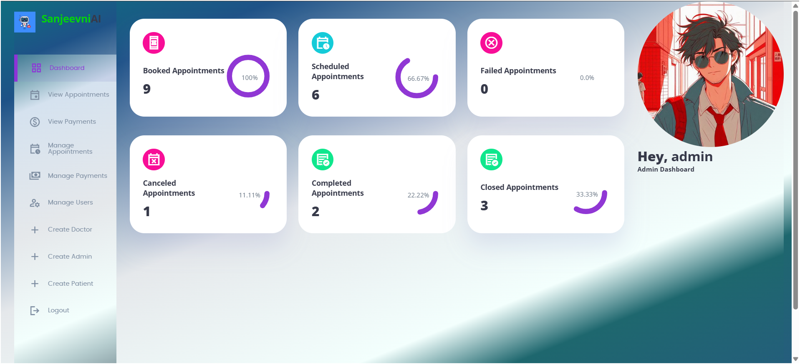
    - Admin Panel  
    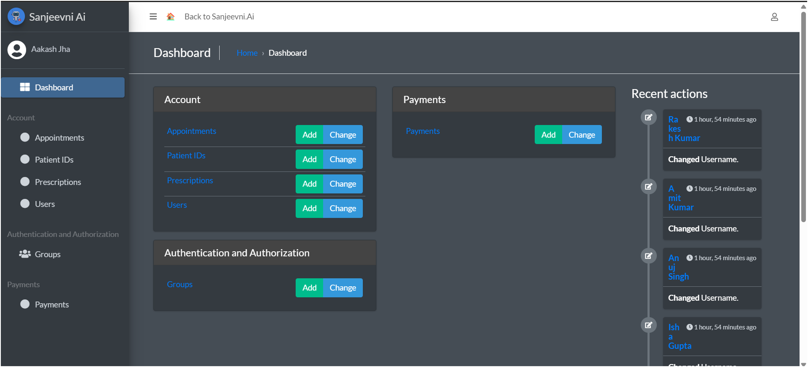
    - Manage Permissions and Roles  
    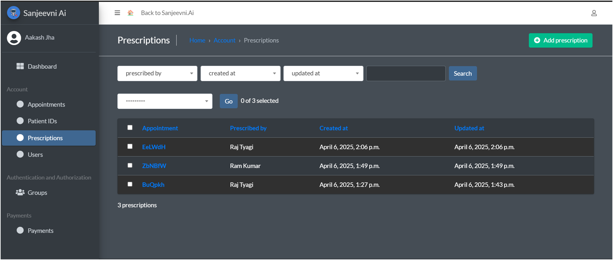

    ### 🔹 Doctor Interface
    - Doctor Dashboard  
    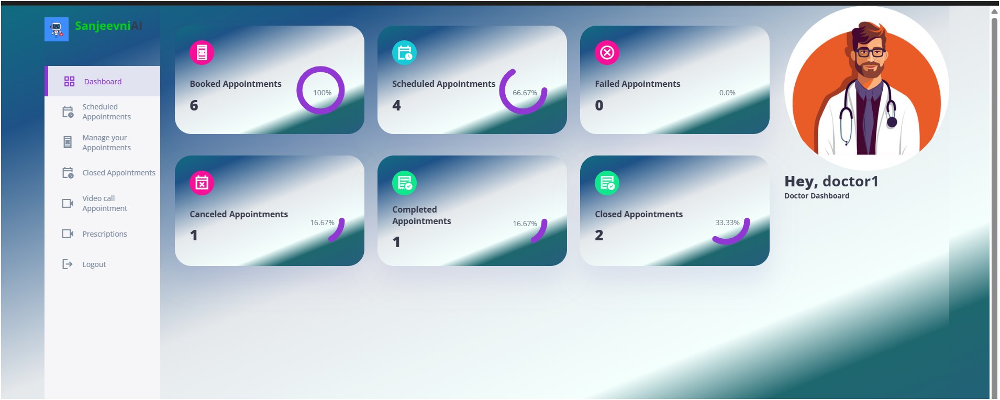
    - E-Prescription by Doctor  
    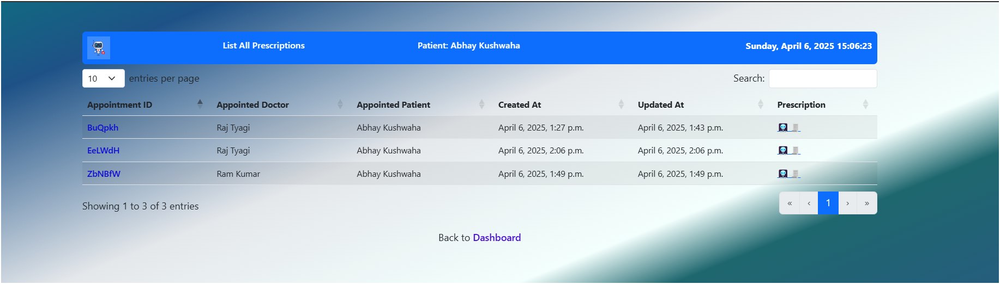

    ### 🔹 Patient Interface
    - Patient Dashboard  
    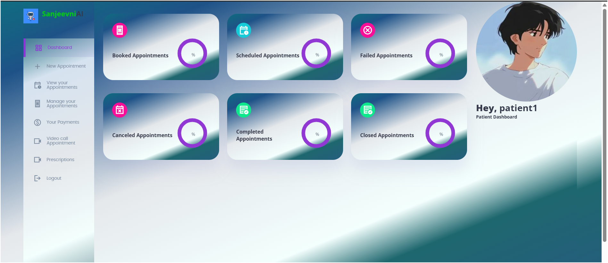
    - Schedule Appointment  
    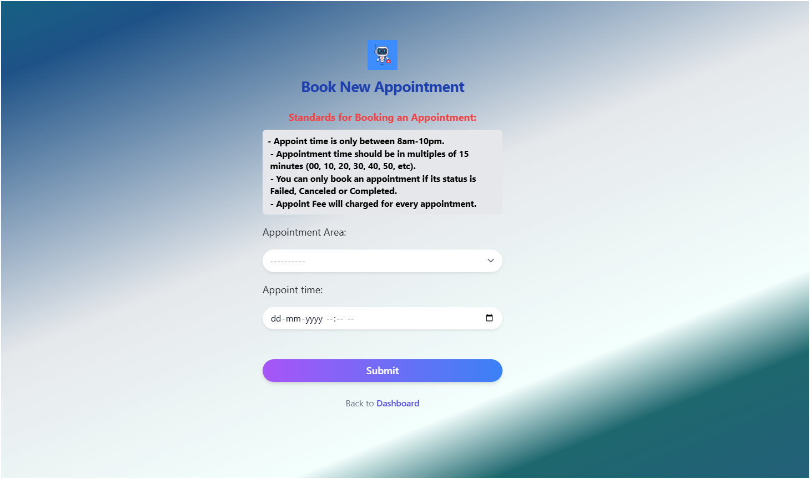
    - Manage Appointments & Patients  
    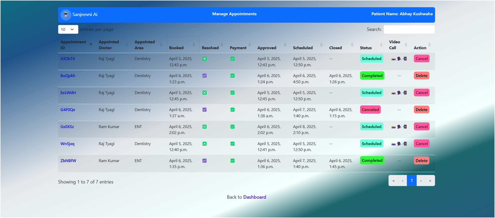

    ### 🔹 Database & Record Management
    - Manage Database Records  
    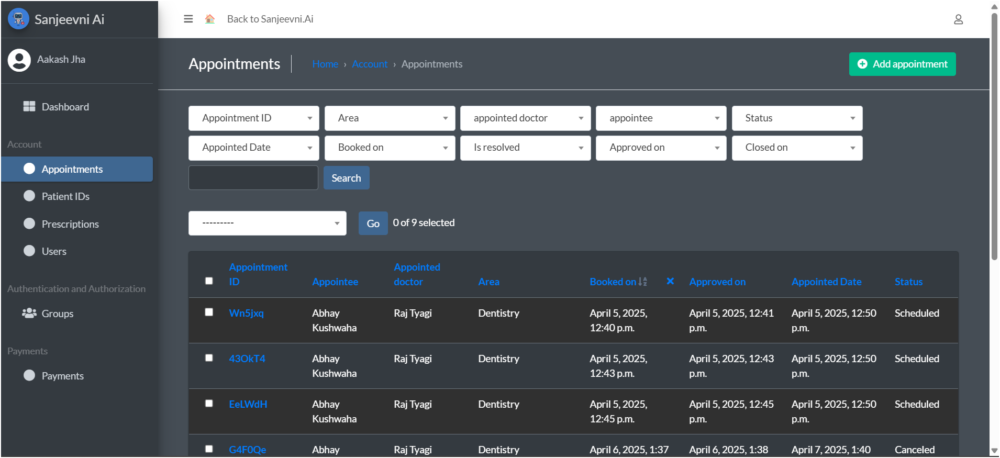

    ### 🔹 AI Features
    - AI Based Prediction  
    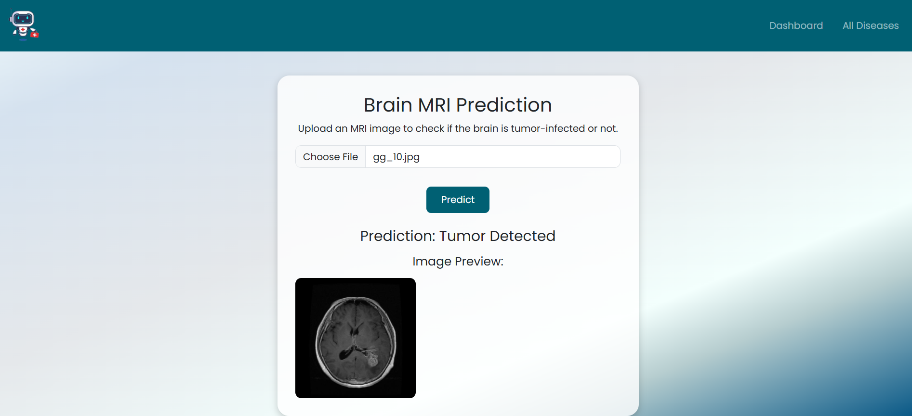
    - Symptoms Based Prediction by Talking Human-like Nurse  
    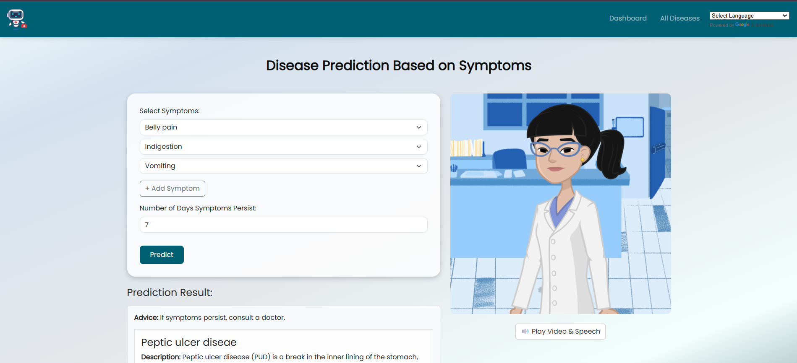
    - All Diseases Dashboard  
    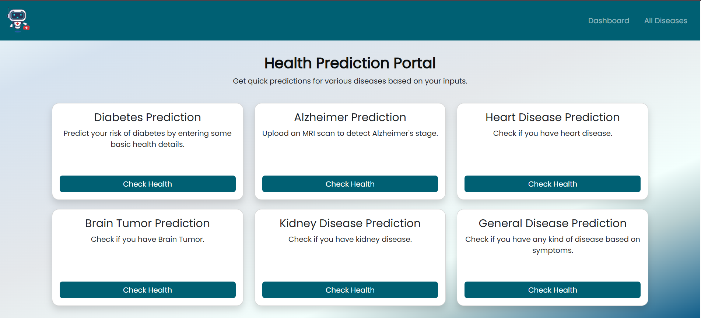

    ### 🔹 Communication
    - One-on-One Video Conference  
    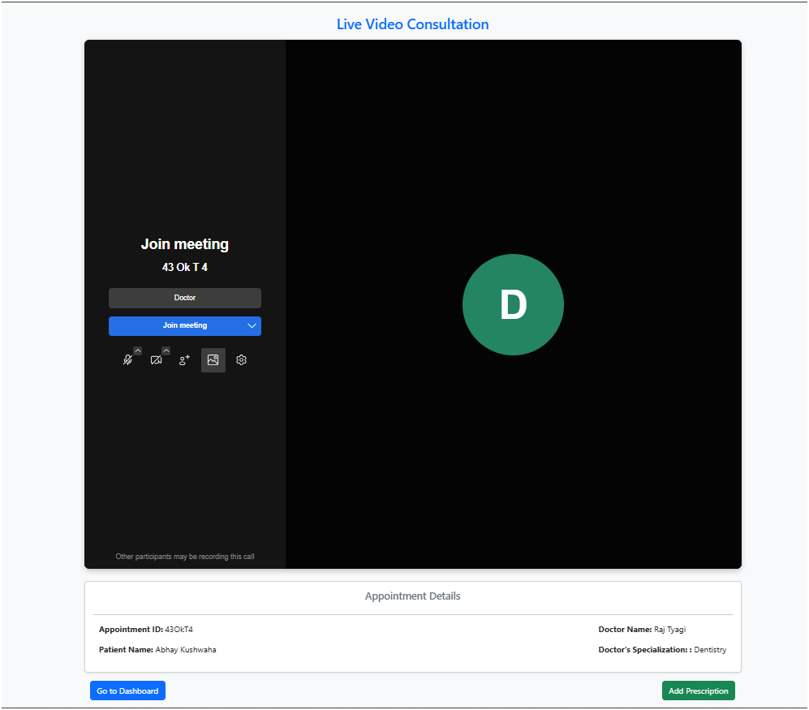

    ### 🔹 Language Support
    - Multi-Lingual Interface  
    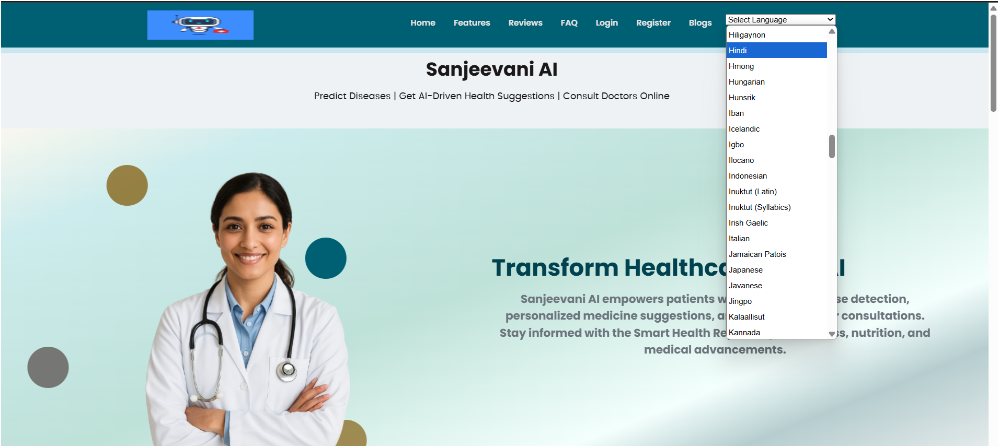

    ---

    ### 5. Medicine Booking & Payment

    

    ---

    ## 🚀 Scalability & Feasibility

    - Built using **Python Django**, **HTML/CSS/JS**, **Bootstrap/Tailwind**, **TensorFlow**, **Scikit-learn**
    - Scalable with **Docker containers** and **Cloud hosting**
    - Easily extendable to add more diseases and models
    - Doctor onboarding and verification system supports large-scale consultation flow

    ---

    ## 💰 Revenue Model

    - 💼 **Subscription Plans** for regular users
    - 🧑‍⚕️ **Commission on Doctor Consultations**
    - 💊 **Partnership with Pharmacies** for medicine orders
    - 🛍️ **Ad placements** for health products

    ---

    ## 🔮 Future Updates

    - Mobile App Version (React Native)
    - Insurance Claim Integration
    - Health Record Tracker
    - Real-time Emergency Help
    - Wearable Device Sync (for live vitals)

    ---

    ## 🧬 Uniqueness of Our Project

    - Seamlessly combines AI diagnosis, expert consultation, and medicine booking in one place.
    - Reduces patient anxiety by offering a one-click solution for health concerns.
    - Voice + Video interaction with animated explanation for user-friendliness.
    - Entire health journey covered within one single site.

    ---

    ---
